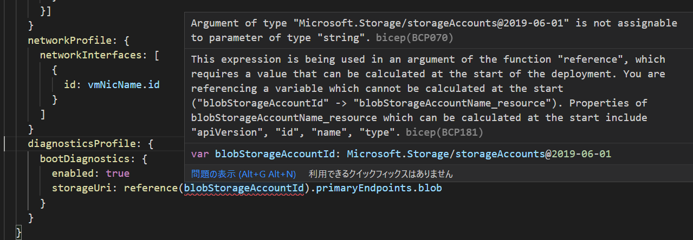
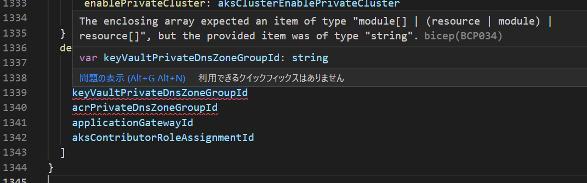

# bicep への変換作業

## decompile する

`bicep decompile` して azuredeploy.bicep から、main.bicepに名前を変更

```sh
% bicep decompile azuredeploy.json
WARNING: Decompilation is a best-effort process, as there is no guaranteed mapping from ARM JSON to Bicep.
You may need to fix warnings and errors in the generated bicep file(s), or decompilation may fail entirely if an accurate conversion is not possible.
If you would like to report any issues or inaccurate conversions, please see https://github.com/Azure/bicep/issues.
azuredeploy.bicep(490,49) : Warning prefer-interpolation: Use string interpolation instead of the concat function. [https://aka.ms/bicep/linter/prefer-interpolation]
azuredeploy.bicep(492,51) : Warning prefer-interpolation: Use string interpolation instead of the concat function. [https://aka.ms/bicep/linter/prefer-interpolation]
azuredeploy.bicep(697,58) : Warning BCP174: Type validation is not available for resource types declared containing a "/providers/" segment. Please instead use the "scope" property. [https://aka.ms/BicepScopes]
azuredeploy.bicep(722,5) : Error BCP034: The enclosing array expected an item of type "module[] | (resource | module) | resource[]", but the provided item was of type "string".
azuredeploy.bicep(723,5) : Error BCP034: The enclosing array expected an item of type "module[] | (resource | module) | resource[]", but the provided item was of type "string".
azuredeploy.bicep(746,5) : Error BCP034: The enclosing array expected an item of type "module[] | (resource | module) | resource[]", but the provided item was of type "string".
azuredeploy.bicep(747,5) : Error BCP034: The enclosing array expected an item of type "module[] | (resource | module) | resource[]", but the provided item was of type "string".
azuredeploy.bicep(751,53) : Warning BCP174: Type validation is not available for resource types declared containing a "/providers/" segment. Please instead use the "scope" property. [https://aka.ms/BicepScopes]
azuredeploy.bicep(764,5) : Error BCP034: The enclosing array expected an item of type "module[] | (resource | module) | resource[]", but the provided item was of type "string".
azuredeploy.bicep(765,5) : Error BCP034: The enclosing array expected an item of type "module[] | (resource | module) | resource[]", but the provided item was of type "string".
azuredeploy.bicep(795,5) : Error BCP034: The enclosing array expected an item of type "module[] | (resource | module) | resource[]", but the provided item was of type "string".
azuredeploy.bicep(825,31) : Warning BCP036: The property "storageAccountType" expected a value of type "'Premium_LRS' | 'StandardSSD_LRS' | 'Standard_LRS' | 'UltraSSD_LRS' | null" but the provided value is of type "'Premium_LRS' | 'Premium_ZRS' | 'StandardSSD_LRS' | 'StandardSSD_ZRS' | 'Standard_LRS'".
azuredeploy.bicep(835,31) : Warning BCP036: The property "storageAccountType" expected a value of type "'Premium_LRS' | 'StandardSSD_LRS' | 'Standard_LRS' | 'UltraSSD_LRS' | null" but the provided value is of type "'Premium_LRS' | 'Premium_ZRS' | 'StandardSSD_LRS' | 'StandardSSD_ZRS' | 'Standard_LRS'".
azuredeploy.bicep(854,5) : Error BCP034: The enclosing array expected an item of type "module[] | (resource | module) | resource[]", but the provided item was of type "string".
azuredeploy.bicep(860,9) : Warning simplify-interpolation: Remove unnecessary string interpolation. [https://aka.ms/bicep/linter/simplify-interpolation]
azuredeploy.bicep(875,5) : Error BCP034: The enclosing array expected an item of type "module[] | (resource | module) | resource[]", but the provided item was of type "string".
azuredeploy.bicep(876,5) : Error BCP034: The enclosing array expected an item of type "module[] | (resource | module) | resource[]", but the provided item was of type "string".
azuredeploy.bicep(882,9) : Warning simplify-interpolation: Remove unnecessary string interpolation. [https://aka.ms/bicep/linter/simplify-interpolation]
azuredeploy.bicep(891,5) : Error BCP034: The enclosing array expected an item of type "module[] | (resource | module) | resource[]", but the provided item was of type "string".
azuredeploy.bicep(892,5) : Error BCP034: The enclosing array expected an item of type "module[] | (resource | module) | resource[]", but the provided item was of type "string".
azuredeploy.bicep(893,5) : Error BCP034: The enclosing array expected an item of type "module[] | (resource | module) | resource[]", but the provided item was of type "string".
azuredeploy.bicep(919,53) : Warning BCP174: Type validation is not available for resource types declared containing a "/providers/" segment. Please instead use the "scope" property. [https://aka.ms/BicepScopes]
azuredeploy.bicep(944,5) : Error BCP034: The enclosing array expected an item of type "module[] | (resource | module) | resource[]", but the provided item was of type "string".
azuredeploy.bicep(945,5) : Error BCP034: The enclosing array expected an item of type "module[] | (resource | module) | resource[]", but the provided item was of type "string".
azuredeploy.bicep(1000,5) : Error BCP034: The enclosing array expected an item of type "module[] | (resource | module) | resource[]", but the provided item was of type "string".
azuredeploy.bicep(1001,5) : Error BCP034: The enclosing array expected an item of type "module[] | (resource | module) | resource[]", but the provided item was of type "string".
azuredeploy.bicep(1027,5) : Warning BCP073: The property "scope" is read-only. Expressions cannot be assigned to read-only properties.
azuredeploy.bicep(1030,5) : Error BCP034: The enclosing array expected an item of type "module[] | (resource | module) | resource[]", but the provided item was of type "string".
azuredeploy.bicep(1031,5) : Error BCP034: The enclosing array expected an item of type "module[] | (resource | module) | resource[]", but the provided item was of type "string".
azuredeploy.bicep(1082,5) : Error BCP034: The enclosing array expected an item of type "module[] | (resource | module) | resource[]", but the provided item was of type "string".
azuredeploy.bicep(1083,5) : Error BCP034: The enclosing array expected an item of type "module[] | (resource | module) | resource[]", but the provided item was of type "string".
azuredeploy.bicep(1087,50) : Warning BCP174: Type validation is not available for resource types declared containing a "/providers/" segment. Please instead use the "scope" property. [https://aka.ms/BicepScopes]
azuredeploy.bicep(1105,5) : Error BCP034: The enclosing array expected an item of type "module[] | (resource | module) | resource[]", but the provided item was of type "string".
azuredeploy.bicep(1106,5) : Error BCP034: The enclosing array expected an item of type "module[] | (resource | module) | resource[]", but the provided item was of type "string".
azuredeploy.bicep(1110,63) : Warning BCP174: Type validation is not available for resource types declared containing a "/providers/" segment. Please instead use the "scope" property. [https://aka.ms/BicepScopes]
azuredeploy.bicep(1118,5) : Error BCP034: The enclosing array expected an item of type "module[] | (resource | module) | resource[]", but the provided item was of type "string".
azuredeploy.bicep(1119,5) : Error BCP034: The enclosing array expected an item of type "module[] | (resource | module) | resource[]", but the provided item was of type "string".
azuredeploy.bicep(1132,5) : Warning BCP073: The property "tier" is read-only. Expressions cannot be assigned to read-only properties.
azuredeploy.bicep(1160,5) : Error BCP034: The enclosing array expected an item of type "module[] | (resource | module) | resource[]", but the provided item was of type "string".
azuredeploy.bicep(1164,44) : Warning BCP174: Type validation is not available for resource types declared containing a "/providers/" segment. Please instead use the "scope" property. [https://aka.ms/BicepScopes]
azuredeploy.bicep(1172,5) : Error BCP034: The enclosing array expected an item of type "module[] | (resource | module) | resource[]", but the provided item was of type "string".
azuredeploy.bicep(1173,5) : Error BCP034: The enclosing array expected an item of type "module[] | (resource | module) | resource[]", but the provided item was of type "string".
azuredeploy.bicep(1177,45) : Warning BCP174: Type validation is not available for resource types declared containing a "/providers/" segment. Please instead use the "scope" property. [https://aka.ms/BicepScopes]
azuredeploy.bicep(1200,5) : Error BCP034: The enclosing array expected an item of type "module[] | (resource | module) | resource[]", but the provided item was of type "string".
azuredeploy.bicep(1201,5) : Error BCP034: The enclosing array expected an item of type "module[] | (resource | module) | resource[]", but the provided item was of type "string".
azuredeploy.bicep(1218,5) : Warning BCP037: The property "sku" is not allowed on objects of type "ManagedClusterProperties". Permissible properties include "autoUpgradeProfile", "diskEncryptionSetID", "enablePodSecurityPolicy", "identityProfile", "nodeResourceGroup", "servicePrincipalProfile", "windowsProfile". If this is an inaccuracy in the documentation, please report it to the Bicep Team. [https://aka.ms/bicep-type-issues]
azuredeploy.bicep(1299,9) : Warning BCP073: The property "identity" is read-only. Expressions cannot be assigned to read-only properties.
azuredeploy.bicep(1337,5) : Error BCP034: The enclosing array expected an item of type "module[] | (resource | module) | resource[]", but the provided item was of type "string".
azuredeploy.bicep(1338,5) : Error BCP034: The enclosing array expected an item of type "module[] | (resource | module) | resource[]", but the provided item was of type "string".
azuredeploy.bicep(1339,5) : Error BCP034: The enclosing array expected an item of type "module[] | (resource | module) | resource[]", but the provided item was of type "string".
azuredeploy.bicep(1340,5) : Error BCP034: The enclosing array expected an item of type "module[] | (resource | module) | resource[]", but the provided item was of type "string".
azuredeploy.bicep(1341,5) : Error BCP034: The enclosing array expected an item of type "module[] | (resource | module) | resource[]", but the provided item was of type "string".
azuredeploy.bicep(1342,5) : Error BCP034: The enclosing array expected an item of type "module[] | (resource | module) | resource[]", but the provided item was of type "string".
azuredeploy.bicep(1346,52) : Warning BCP174: Type validation is not available for resource types declared containing a "/providers/" segment. Please instead use the "scope" property. [https://aka.ms/BicepScopes]
azuredeploy.bicep(1388,5) : Error BCP034: The enclosing array expected an item of type "module[] | (resource | module) | resource[]", but the provided item was of type "string".
azuredeploy.bicep(1389,5) : Error BCP034: The enclosing array expected an item of type "module[] | (resource | module) | resource[]", but the provided item was of type "string".
azuredeploy.bicep(1422,5) : Warning BCP073: The property "maxNumberOfRecordSets" is read-only. Expressions cannot be assigned to read-only properties.
azuredeploy.bicep(1423,5) : Warning BCP073: The property "maxNumberOfVirtualNetworkLinks" is read-only. Expressions cannot be assigned to read-only properties.
azuredeploy.bicep(1424,5) : Warning BCP073: The property "maxNumberOfVirtualNetworkLinksWithRegistration" is read-only. Expressions cannot be assigned to read-only properties.
azuredeploy.bicep(1432,5) : Warning BCP073: The property "maxNumberOfRecordSets" is read-only. Expressions cannot be assigned to read-only properties.
azuredeploy.bicep(1433,5) : Warning BCP073: The property "maxNumberOfVirtualNetworkLinks" is read-only. Expressions cannot be assigned to read-only properties.
azuredeploy.bicep(1434,5) : Warning BCP073: The property "maxNumberOfVirtualNetworkLinksWithRegistration" is read-only. Expressions cannot be assigned to read-only properties.
azuredeploy.bicep(1442,5) : Warning BCP073: The property "maxNumberOfRecordSets" is read-only. Expressions cannot be assigned to read-only properties.
azuredeploy.bicep(1443,5) : Warning BCP073: The property "maxNumberOfVirtualNetworkLinks" is read-only. Expressions cannot be assigned to read-only properties.
azuredeploy.bicep(1444,5) : Warning BCP073: The property "maxNumberOfVirtualNetworkLinksWithRegistration" is read-only. Expressions cannot be assigned to read-only properties.
azuredeploy.bicep(1459,5) : Error BCP034: The enclosing array expected an item of type "module[] | (resource | module) | resource[]", but the provided item was of type "string".
azuredeploy.bicep(1460,5) : Error BCP034: The enclosing array expected an item of type "module[] | (resource | module) | resource[]", but the provided item was of type "string".
azuredeploy.bicep(1475,5) : Error BCP034: The enclosing array expected an item of type "module[] | (resource | module) | resource[]", but the provided item was of type "string".
azuredeploy.bicep(1476,5) : Error BCP034: The enclosing array expected an item of type "module[] | (resource | module) | resource[]", but the provided item was of type "string".
azuredeploy.bicep(1491,5) : Error BCP034: The enclosing array expected an item of type "module[] | (resource | module) | resource[]", but the provided item was of type "string".
azuredeploy.bicep(1492,5) : Error BCP034: The enclosing array expected an item of type "module[] | (resource | module) | resource[]", but the provided item was of type "string".
azuredeploy.bicep(1516,5) : Error BCP034: The enclosing array expected an item of type "module[] | (resource | module) | resource[]", but the provided item was of type "string".
azuredeploy.bicep(1517,5) : Error BCP034: The enclosing array expected an item of type "module[] | (resource | module) | resource[]", but the provided item was of type "string".
azuredeploy.bicep(1523,9) : Warning simplify-interpolation: Remove unnecessary string interpolation. [https://aka.ms/bicep/linter/simplify-interpolation]
azuredeploy.bicep(1524,3) : Warning BCP187: The property "location" does not exist in the resource definition, although it might still be valid. If this is an inaccuracy in the documentation, please report it to the Bicep Team. [https://aka.ms/bicep-type-issues]
azuredeploy.bicep(1536,5) : Error BCP034: The enclosing array expected an item of type "module[] | (resource | module) | resource[]", but the provided item was of type "string".
azuredeploy.bicep(1537,5) : Error BCP034: The enclosing array expected an item of type "module[] | (resource | module) | resource[]", but the provided item was of type "string".
azuredeploy.bicep(1538,5) : Error BCP034: The enclosing array expected an item of type "module[] | (resource | module) | resource[]", but the provided item was of type "string".
azuredeploy.bicep(1562,5) : Error BCP034: The enclosing array expected an item of type "module[] | (resource | module) | resource[]", but the provided item was of type "string".
azuredeploy.bicep(1563,5) : Error BCP034: The enclosing array expected an item of type "module[] | (resource | module) | resource[]", but the provided item was of type "string".
azuredeploy.bicep(1569,9) : Warning simplify-interpolation: Remove unnecessary string interpolation. [https://aka.ms/bicep/linter/simplify-interpolation]
azuredeploy.bicep(1570,3) : Warning BCP187: The property "location" does not exist in the resource definition, although it might still be valid. If this is an inaccuracy in the documentation, please report it to the Bicep Team. [https://aka.ms/bicep-type-issues]
azuredeploy.bicep(1582,5) : Error BCP034: The enclosing array expected an item of type "module[] | (resource | module) | resource[]", but the provided item was of type "string".
azuredeploy.bicep(1583,5) : Error BCP034: The enclosing array expected an item of type "module[] | (resource | module) | resource[]", but the provided item was of type "string".
azuredeploy.bicep(1584,5) : Error BCP034: The enclosing array expected an item of type "module[] | (resource | module) | resource[]", but the provided item was of type "string".
azuredeploy.bicep(1608,5) : Error BCP034: The enclosing array expected an item of type "module[] | (resource | module) | resource[]", but the provided item was of type "string".
azuredeploy.bicep(1609,5) : Error BCP034: The enclosing array expected an item of type "module[] | (resource | module) | resource[]", but the provided item was of type "string".
azuredeploy.bicep(1615,9) : Warning simplify-interpolation: Remove unnecessary string interpolation. [https://aka.ms/bicep/linter/simplify-interpolation]
azuredeploy.bicep(1616,3) : Warning BCP187: The property "location" does not exist in the resource definition, although it might still be valid. If this is an inaccuracy in the documentation, please report it to the Bicep Team. [https://aka.ms/bicep-type-issues]
azuredeploy.bicep(1628,5) : Error BCP034: The enclosing array expected an item of type "module[] | (resource | module) | resource[]", but the provided item was of type "string".
azuredeploy.bicep(1629,5) : Error BCP034: The enclosing array expected an item of type "module[] | (resource | module) | resource[]", but the provided item was of type "string".
azuredeploy.bicep(1630,5) : Error BCP034: The enclosing array expected an item of type "module[] | (resource | module) | resource[]", but the provided item was of type "string".
azuredeploy.bicep(1637,3) : Warning BCP035: The specified "object" declaration is missing the following required properties: "actions".
azuredeploy.bicep(1724,14) : Warning BCP036: The property "state" expected a value of type "'Disabled' | 'Enabled' | null" but the provided value is of type "'Disabled ' | 'Enabled'".
azuredeploy.bicep(1874,5) : Error BCP034: The enclosing array expected an item of type "module[] | (resource | module) | resource[]", but the provided item was of type "string".
azuredeploy.bicep(1875,5) : Error BCP034: The enclosing array expected an item of type "module[] | (resource | module) | resource[]", but the provided item was of type "string".
azuredeploy.bicep(1876,5) : Error BCP034: The enclosing array expected an item of type "module[] | (resource | module) | resource[]", but the provided item was of type "string".
azuredeploy.bicep(1877,5) : Error BCP034: The enclosing array expected an item of type "module[] | (resource | module) | resource[]", but the provided item was of type "string".
azuredeploy.bicep(1881,60) : Warning BCP174: Type validation is not available for resource types declared containing a "/providers/" segment. Please instead use the "scope" property. [https://aka.ms/BicepScopes]
azuredeploy.bicep(1907,5) : Error BCP034: The enclosing array expected an item of type "module[] | (resource | module) | resource[]", but the provided item was of type "string".
azuredeploy.bicep(1908,5) : Error BCP034: The enclosing array expected an item of type "module[] | (resource | module) | resource[]", but the provided item was of type "string".
azuredeploy.bicep(1918,5) : Warning BCP073: The property "scope" is read-only. Expressions cannot be assigned to read-only properties.
azuredeploy.bicep(1921,5) : Error BCP034: The enclosing array expected an item of type "module[] | (resource | module) | resource[]", but the provided item was of type "string".
azuredeploy.bicep(1922,5) : Error BCP034: The enclosing array expected an item of type "module[] | (resource | module) | resource[]", but the provided item was of type "string".
% mv azuredeploy.bicep main.bicep
```

## ErrorとWarning をざっとみる

エラーと警告が多いので、どんなメッセージが出てるのかをざっと見る。

```sh
% bicep decompile azuredeploy.json 2>&1 | grep -e Error -e Warning | cut -d : -f 2 | sort | uniq -c | sort -n -r
     67  Error BCP034
     13  Warning BCP073
      9  Warning BCP174
      5  Warning simplify-interpolation
      3  Warning BCP187
      3  Warning BCP036
      2  Warning prefer-interpolation
      1  Warning BCP037
      1  Warning BCP035
```

## Error BCP034

一番多いのが、`Error BCP034` で、

```log
Error BCP034: The enclosing array expected an item of type "module[] | (resource | module) | resource[]", but the provided item was of type "string".
```

ARM Templateでは、下記のようになってた部分が、

```json
{
  "type": "providers/diagnosticSettings",
  "apiVersion": "2017-05-01-preview",
  "name": "Microsoft.Insights/default",
  "location": "[parameters('location')]",
  "dependsOn": [
    "[variables('bastionSubnetNsgId')]",
    "[variables('workspaceId')]"
  ],
  "properties": {
    "workspaceId": "[variables('workspaceId')]",
    "logs": [
      {
        "category": "NetworkSecurityGroupEvent",
        "enabled": true,
        "retentionPolicy": {
          "enabled": false,
          "days": 0
        }
      },
      {
        "category": "NetworkSecurityGroupRuleCounter",
        "enabled": true,
        "retentionPolicy": {
          "enabled": false,
          "days": 0
        }
      }
    ]
  }
}
```

下記のようにデコンパイルされています。

```bicep
resource bastionSubnetNsgName_Microsoft_Insights_default 'Microsoft.Network/networkSecurityGroups/providers/diagnosticSettings@2017-05-01-preview' = {
  name: '${bastionSubnetNsgName_var}/Microsoft.Insights/default'
  location: location
  properties: {
    workspaceId: workspaceId
    logs: [
      {
        category: 'NetworkSecurityGroupEvent'
        enabled: true
        retentionPolicy: {
          enabled: false
          days: 0
        }
      }
      {
        category: 'NetworkSecurityGroupRuleCounter'
        enabled: true
        retentionPolicy: {
          enabled: false
          days: 0
        }
      }
    ]
  }
  dependsOn: [
    bastionSubnetNsgId
    workspaceId
  ]
}
```

問題は、dependsOn で変数でリソースIDを書いている部分でした。

```json
 "dependsOn": [
    "[variables('bastionSubnetNsgId')]",
    "[variables('workspaceId')]"
  ],```
```

bicepでこのようになっていますが、ここには、リソースかモジュールが必要です。

```bicep
  dependsOn: [
    bastionSubnetNsgId
    workspaceId
  ]
```

関連: https://github.com/Azure/bicep/issues/2477

暗黙のdependOnを使いたいのですが、まずは、Idでは無くリソースを使うように直します。

テンプレートを見ると、下記のようなパターンでコーディングされていました。最終的には、この変数は不要なので削除することにして、まずは暫定的に直してエラーを消します。

```bicep
var bastionSubnetNsgId = bastionSubnetNsgName.id
```

暫定修正、

```bicep
var bastionSubnetNsgId = bastionSubnetNsgName
```

機械的にIDを変数定義していた部分を全部直しました。

```sh
% bicep build main.bicep 2>&1  | grep -e Error | cut -d : -f 2 | sort | uniq -c | sort -n -r

     12  Error BCP181
     12  Error BCP070
      2  Error BCP120
%
```

数は減って、BCP034は無くなり3つのエラーに別れました。多分IDが要求されるところがあるのだと思います。

## Error BCP181

こんなエラーでした。BCP034の修正が強引だったので仕方がないです、直します。



デコンパイル結果は下記のようになっていますが、

```bicep
storageUri: reference(blobStorageAccountId).primaryEndpoints.blob
```

blobStorageAccountIdをリソースのシンボルにしてしまったので、これは使えず。下記のように直します。

```bicep
storageUri: blobStorageAccountId.properties.primaryEndpoints.blob
```

他にも、`list<Action>` のパターンがありました。下記のように直します。

修正前

```bicep
workspaceKey:  listKeys(workspaceId, '2020-03-01-preview').primarySharedKey
```

修正後

```bicep
workspaceKey:  workspaceId.listKeys().primarySharedKey
```

このパターンを全部修正した

```sh
% bicep build main.bicep 2>&1  | grep -e Error | cut -d : -f 2 | sort | uniq -c | sort -n -r
      2  Error BCP120
      2  Error BCP034
```

4つになったので、個別に確認

```log
main.bicep(1211,10) : Error BCP120: This expression is being used in an assignment to the "identity" property of the "Microsoft.ContainerService/managedClusters" type, which requires a value that can be calculated at the start of the deployment. You are referencing a variable which cannot be calculated at the start ("aksClusterUserDefinedManagedIdentityId" -> "aksClusterUserDefinedManagedIdentityName"). Properties of aksClusterUserDefinedManagedIdentityName which can be calculated at the start include "apiVersion", "id", "name", "type".
main.bicep(1339,5) : Error BCP034: The enclosing array expected an item of type "module[] | (resource | module) | resource[]", but the provided item was of type "string".
main.bicep(1340,5) : Error BCP034: The enclosing array expected an item of type "module[] | (resource | module) | resource[]", but the provided item was of type "string".
main.bicep(1743,10) : Error BCP120: This expression is being used in an assignment to the "identity" property of the "Microsoft.Network/applicationGateways" type, which requires a value that can be calculated at the start of the deployment. You are referencing a variable which cannot be calculated at the start ("applicationGatewayUserDefinedManagedIdentityId" -> "applicationGatewayUserDefinedManagedIdentityName"). Properties of applicationGatewayUserDefinedManagedIdentityName which can be calculated at the start include "apiVersion", "id", "name", "type".
```

簡単そうなので、BCP034 から直す。

## Error BCP034 再び

下記２つが、dependsOnに書いてあって、リソースでもモジュールでも無いのが問題。

- keyVaultPrivateDnsZoneGroupId
- acrPrivateDnsZoneGroupId



resourceIdを使っているのを、existing に変更する。循環参照になってしまうかもしれないが、まずは気にしない。

```json
var keyVaultPrivateDnsZoneGroupId = resourceId('Microsoft.Network/privateEndpoints/privateDnsZoneGroups', keyVaultPrivateEndpointName, '${keyVaultPrivateEndpointGroupName}PrivateDnsZoneGroup')

var acrPrivateDnsZoneGroupId = resourceId('Microsoft.Network/privateEndpoints/privateDnsZoneGroups', acrPrivateEndpointName, '${acrPrivateEndpointGroupName}PrivateDnsZoneGroup')

```

```bicep
resource keyVaultPrivateDnsZoneGroupId 'Microsoft.Network/privateEndpoints/privateDnsZoneGroups@2021-02-01' existing = {
  name:keyVaultPrivateEndpointGroupName
}

resource acrPrivateDnsZoneGroupId 'Microsoft.Network/privateEndpoints/privateDnsZoneGroups@2021-02-01' existing = {
  name:acrPrivateEndpointGroupName
}
```

## Error BCP120

下記のような、エラーになる。

> This expression is being used in an assignment to the "identity" property of the "Microsoft.ContainerService/managedClusters" type, which requires a value that can be calculated at the start of the deployment. You are referencing a variable which cannot be calculated at the start ("aksClusterUserDefinedManagedIdentityId" -> "aksClusterUserDefinedManagedIdentityName"). Properties of aksClusterUserDefinedManagedIdentityName which can be calculated at the start include "apiVersion", "id", "name", "type".bicep(BCP120)

これは、`'${aksClusterUserDefinedManagedIdentityId}'`の部分には、展開の開始時に計算できる値が必要ということ。
変数、aksClusterUserDefinedManagedIdentityId では無くて、aksClusterUserDefinedManagedIdentityName を使う必要がある。

修正前

```bicep
var aksClusterUserDefinedManagedIdentityId = aksClusterUserDefinedManagedIdentityName
.... snip ....
identity: {
  type: 'UserAssigned'
  userAssignedIdentities: {
    '${aksClusterUserDefinedManagedIdentityId}': {}
  }
}
```

修正後

```bicep
var aksClusterUserDefinedManagedIdentityId = aksClusterUserDefinedManagedIdentityName
.... snip ....
identity: {
  type: 'UserAssigned'
  userAssignedIdentities: {
    '${aksClusterUserDefinedManagedIdentityName.id}': {}
  }
}
```

`aksClusterUserDefinedManagedIdentityId` を使っているところは別にもあるので、変数としては残して置く。
`applicationGatewayUserDefinedManagedIdentityId` も同様に直す。

ここまでで、Errorは全部無くなった。

## bicep build したら、スタックを吐いた

```sh
% bicep build main.bicep
./main.bicep(490,49) : Warning prefer-interpolation: Use string interpolation instead of the concat function. [https://aka.ms/bicep/linter/prefer-interpolation]
./main.bicep(492,51) : Warning prefer-interpolation: Use string interpolation instead of the concat function. [https://aka.ms/bicep/linter/prefer-interpolation]
./main.bicep(703,58) : Warning BCP174: Type validation is not available for resource types declared containing a "/providers/" segment. Please instead use the "scope" property. [https://aka.ms/BicepScopes]
./main.bicep(745,17) : Warning BCP036: The property "id" expected a value of type "null | string" but the provided value is of type "Microsoft.Network/publicIPAddresses@2020-05-01".
./main.bicep(757,53) : Warning BCP174: Type validation is not available for resource types declared containing a "/providers/" segment. Please instead use the "scope" property. [https://aka.ms/BicepScopes]
./main.bicep(831,31) : Warning BCP036: The property "storageAccountType" expected a value of type "'Premium_LRS' | 'StandardSSD_LRS' | 'Standard_LRS' | 'UltraSSD_LRS' | null" but the provided value is of type "'Premium_LRS' | 'Premium_ZRS' | 'StandardSSD_LRS' | 'StandardSSD_ZRS' | 'Standard_LRS'".
./main.bicep(841,31) : Warning BCP036: The property "storageAccountType" expected a value of type "'Premium_LRS' | 'StandardSSD_LRS' | 'Standard_LRS' | 'UltraSSD_LRS' | null" but the provided value is of type "'Premium_LRS' | 'Premium_ZRS' | 'StandardSSD_LRS' | 'StandardSSD_ZRS' | 'Standard_LRS'".
./main.bicep(866,9) : Warning simplify-interpolation: Remove unnecessary string interpolation. [https://aka.ms/bicep/linter/simplify-interpolation]
./main.bicep(888,9) : Warning simplify-interpolation: Remove unnecessary string interpolation. [https://aka.ms/bicep/linter/simplify-interpolation]
./main.bicep(925,53) : Warning BCP174: Type validation is not available for resource types declared containing a "/providers/" segment. Please instead use the "scope" property. [https://aka.ms/BicepScopes]
./main.bicep(978,17) : Warning BCP036: The property "id" expected a value of type "null | string" but the provided value is of type "Microsoft.Network/networkSecurityGroups@2020-07-01".
./main.bicep(997,17) : Warning BCP036: The property "id" expected a value of type "null | string" but the provided value is of type "Microsoft.Network/networkSecurityGroups@2020-07-01".
./main.bicep(1033,5) : Warning BCP073: The property "scope" is read-only. Expressions cannot be assigned to read-only properties.
./main.bicep(1093,50) : Warning BCP174: Type validation is not available for resource types declared containing a "/providers/" segment. Please instead use the "scope" property. [https://aka.ms/BicepScopes]
./main.bicep(1116,63) : Warning BCP174: Type validation is not available for resource types declared containing a "/providers/" segment. Please instead use the "scope" property. [https://aka.ms/BicepScopes]
./main.bicep(1138,5) : Warning BCP073: The property "tier" is read-only. Expressions cannot be assigned to read-only properties.
./main.bicep(1170,44) : Warning BCP174: Type validation is not available for resource types declared containing a "/providers/" segment. Please instead use the "scope" property. [https://aka.ms/BicepScopes]
./main.bicep(1183,45) : Warning BCP174: Type validation is not available for resource types declared containing a "/providers/" segment. Please instead use the "scope" property. [https://aka.ms/BicepScopes]
./main.bicep(1224,5) : Warning BCP037: The property "sku" is not allowed on objects of type "ManagedClusterProperties". Permissible properties include "autoUpgradeProfile", "diskEncryptionSetID", "enablePodSecurityPolicy", "identityProfile", "nodeResourceGroup", "servicePrincipalProfile", "windowsProfile". If this is an inaccuracy in the documentation, please report it to the Bicep Team. [https://aka.ms/bicep-type-issues]
./main.bicep(1285,44) : Warning BCP036: The property "logAnalyticsWorkspaceResourceID" expected a value of type "string" but the provided value is of type "Microsoft.OperationalInsights/workspaces@2020-08-01".
./main.bicep(1302,33) : Warning BCP036: The property "applicationGatewayId" expected a value of type "string" but the provided value is of type "Microsoft.Network/applicationGateways@2020-05-01".
./main.bicep(1305,9) : Warning BCP073: The property "identity" is read-only. Expressions cannot be assigned to read-only properties.
./main.bicep(1352,52) : Warning BCP174: Type validation is not available for resource types declared containing a "/providers/" segment. Please instead use the "scope" property. [https://aka.ms/BicepScopes]
./main.bicep(1428,5) : Warning BCP073: The property "maxNumberOfRecordSets" is read-only. Expressions cannot be assigned to read-only properties.
./main.bicep(1429,5) : Warning BCP073: The property "maxNumberOfVirtualNetworkLinks" is read-only. Expressions cannot be assigned to read-only properties.
./main.bicep(1430,5) : Warning BCP073: The property "maxNumberOfVirtualNetworkLinksWithRegistration" is read-only. Expressions cannot be assigned to read-only properties.
./main.bicep(1438,5) : Warning BCP073: The property "maxNumberOfRecordSets" is read-only. Expressions cannot be assigned to read-only properties.
./main.bicep(1439,5) : Warning BCP073: The property "maxNumberOfVirtualNetworkLinks" is read-only. Expressions cannot be assigned to read-only properties.
./main.bicep(1440,5) : Warning BCP073: The property "maxNumberOfVirtualNetworkLinksWithRegistration" is read-only. Expressions cannot be assigned to read-only properties.
./main.bicep(1448,5) : Warning BCP073: The property "maxNumberOfRecordSets" is read-only. Expressions cannot be assigned to read-only properties.
./main.bicep(1449,5) : Warning BCP073: The property "maxNumberOfVirtualNetworkLinks" is read-only. Expressions cannot be assigned to read-only properties.
./main.bicep(1450,5) : Warning BCP073: The property "maxNumberOfVirtualNetworkLinksWithRegistration" is read-only. Expressions cannot be assigned to read-only properties.
./main.bicep(1461,11) : Warning BCP036: The property "id" expected a value of type "null | string" but the provided value is of type "Microsoft.Network/virtualNetworks@2020-05-01".
./main.bicep(1477,11) : Warning BCP036: The property "id" expected a value of type "null | string" but the provided value is of type "Microsoft.Network/virtualNetworks@2020-05-01".
./main.bicep(1493,11) : Warning BCP036: The property "id" expected a value of type "null | string" but the provided value is of type "Microsoft.Network/virtualNetworks@2020-05-01".
./main.bicep(1510,33) : Warning BCP036: The property "privateLinkServiceId" expected a value of type "null | string" but the provided value is of type "Microsoft.Storage/storageAccounts@2019-06-01".
./main.bicep(1529,9) : Warning simplify-interpolation: Remove unnecessary string interpolation. [https://aka.ms/bicep/linter/simplify-interpolation]
./main.bicep(1530,3) : Warning BCP187: The property "location" does not exist in the resource definition, although it might still be valid. If this is an inaccuracy in the documentation, please report it to the Bicep Team. [https://aka.ms/bicep-type-issues]
./main.bicep(1536,29) : Warning BCP036: The property "privateDnsZoneId" expected a value of type "null | string" but the provided value is of type "Microsoft.Network/privateDnsZones@2020-06-01".
./main.bicep(1556,33) : Warning BCP036: The property "privateLinkServiceId" expected a value of type "null | string" but the provided value is of type "Microsoft.KeyVault/vaults@2019-09-01".
./main.bicep(1575,9) : Warning simplify-interpolation: Remove unnecessary string interpolation. [https://aka.ms/bicep/linter/simplify-interpolation]
./main.bicep(1576,3) : Warning BCP187: The property "location" does not exist in the resource definition, although it might still be valid. If this is an inaccuracy in the documentation, please report it to the Bicep Team. [https://aka.ms/bicep-type-issues]
./main.bicep(1582,29) : Warning BCP036: The property "privateDnsZoneId" expected a value of type "null | string" but the provided value is of type "Microsoft.Network/privateDnsZones@2020-06-01".
./main.bicep(1602,33) : Warning BCP036: The property "privateLinkServiceId" expected a value of type "null | string" but the provided value is of type "Microsoft.ContainerRegistry/registries@2019-12-01-preview".
./main.bicep(1621,9) : Warning simplify-interpolation: Remove unnecessary string interpolation. [https://aka.ms/bicep/linter/simplify-interpolation]
./main.bicep(1622,3) : Warning BCP187: The property "location" does not exist in the resource definition, although it might still be valid. If this is an inaccuracy in the documentation, please report it to the Bicep Team. [https://aka.ms/bicep-type-issues]
./main.bicep(1628,29) : Warning BCP036: The property "privateDnsZoneId" expected a value of type "null | string" but the provided value is of type "Microsoft.Network/privateDnsZones@2020-06-01".
./main.bicep(1643,3) : Warning BCP035: The specified "object" declaration is missing the following required properties: "actions".
./main.bicep(1730,14) : Warning BCP036: The property "state" expected a value of type "'Disabled' | 'Enabled' | null" but the provided value is of type "'Disabled ' | 'Enabled'".
./main.bicep(1773,17) : Warning BCP036: The property "id" expected a value of type "null | string" but the provided value is of type "Microsoft.Network/publicIPAddresses@2020-05-01".
./main.bicep(1837,17) : Warning BCP036: The property "id" expected a value of type "null | string" but the provided value is of type "Microsoft.Network/ApplicationGatewayWebApplicationFirewallPolicies@2020-06-01".
./main.bicep(1876,11) : Warning BCP036: The property "id" expected a value of type "null | string" but the provided value is of type "Microsoft.Network/ApplicationGatewayWebApplicationFirewallPolicies@2020-06-01".
./main.bicep(1887,60) : Warning BCP174: Type validation is not available for resource types declared containing a "/providers/" segment. Please instead use the "scope" property. [https://aka.ms/BicepScopes]
./main.bicep(1924,5) : Warning BCP073: The property "scope" is read-only. Expressions cannot be assigned to read-only properties.
Unhandled exception. System.InvalidOperationException: Unrecognized base expression Variable
   at Bicep.Core.Emit.ExpressionConverter.ConvertFunction(FunctionCallSyntaxBase functionCall)
   at Bicep.Core.Emit.ExpressionConverter.ConvertExpression(SyntaxBase expression)
   at Bicep.Core.Emit.ExpressionConverter.ToFunctionExpression(SyntaxBase expression)
   at Bicep.Core.Emit.ExpressionConverter.ConvertPropertyAccess(PropertyAccessSyntax propertyAccess)
   at Bicep.Core.Emit.ExpressionConverter.ConvertExpression(SyntaxBase expression)
   at Bicep.Core.Emit.ExpressionEmitter.EmitLanguageExpression(SyntaxBase syntax)
   at Bicep.Core.Emit.ExpressionEmitter.EmitExpression(SyntaxBase syntax)
   at Bicep.Core.Emit.ExpressionEmitter.<>c__DisplayClass25_0.<EmitPropertyInternal>b__0()
   at Bicep.Core.Emit.ExpressionEmitter.EmitPropertyInternal(LanguageExpression expressionKey, Action valueFunc)
   at Bicep.Core.Emit.ExpressionEmitter.EmitPropertyInternal(LanguageExpression expressionKey, SyntaxBase syntaxValue)
   at Bicep.Core.Emit.ExpressionEmitter.EmitProperty(String name, SyntaxBase expressionValue)
   at Bicep.Core.Emit.ExpressionEmitter.EmitObjectProperties(ObjectSyntax objectSyntax, ISet`1 propertiesToOmit)
   at Bicep.Core.Emit.ExpressionEmitter.EmitExpression(SyntaxBase syntax)
   at Bicep.Core.Emit.ExpressionEmitter.<>c__DisplayClass25_0.<EmitPropertyInternal>b__0()
   at Bicep.Core.Emit.ExpressionEmitter.EmitPropertyInternal(LanguageExpression expressionKey, Action valueFunc)
   at Bicep.Core.Emit.ExpressionEmitter.EmitPropertyInternal(LanguageExpression expressionKey, SyntaxBase syntaxValue)
   at Bicep.Core.Emit.ExpressionEmitter.EmitProperty(String name, SyntaxBase expressionValue)
   at Bicep.Core.Emit.ExpressionEmitter.EmitObjectProperties(ObjectSyntax objectSyntax, ISet`1 propertiesToOmit)
   at Bicep.Core.Emit.ExpressionEmitter.EmitExpression(SyntaxBase syntax)
   at Bicep.Core.Emit.ExpressionEmitter.<>c__DisplayClass25_0.<EmitPropertyInternal>b__0()
   at Bicep.Core.Emit.ExpressionEmitter.EmitPropertyInternal(LanguageExpression expressionKey, Action valueFunc)
   at Bicep.Core.Emit.ExpressionEmitter.EmitPropertyInternal(LanguageExpression expressionKey, SyntaxBase syntaxValue)
   at Bicep.Core.Emit.ExpressionEmitter.EmitProperty(String name, SyntaxBase expressionValue)
   at Bicep.Core.Emit.ExpressionEmitter.EmitObjectProperties(ObjectSyntax objectSyntax, ISet`1 propertiesToOmit)
   at Bicep.Core.Emit.TemplateWriter.EmitResource(JsonTextWriter jsonWriter, ResourceMetadata resource, ExpressionEmitter emitter)
   at Bicep.Core.Emit.TemplateWriter.EmitResources(JsonTextWriter jsonWriter, ExpressionEmitter emitter)
   at Bicep.Core.Emit.TemplateWriter.GenerateTemplateWithoutHash()
   at Bicep.Core.Emit.TemplateWriter.Write(JsonTextWriter writer)
   at Bicep.Core.Emit.TemplateEmitter.<>c__DisplayClass6_0.<Emit>b__0()
   at Bicep.Core.Emit.TemplateEmitter.EmitOrFail(Action write)
   at Bicep.Core.Emit.TemplateEmitter.Emit(Stream stream)
   at Bicep.Cli.Services.CompilationWriter.ToFile(Compilation compilation, String outputPath)
   at Bicep.Cli.Commands.BuildCommand.RunAsync(BuildArguments args)
   at Bicep.Cli.Program.RunAsync(String[] args)
   at Bicep.Cli.Program.<Main>(String[] args)
```

`./main.bicep(1924,5)` までは行ってるので、このあたりをみる。

## Warning が邪魔なので消す

`01216a5 Warning消し開始`

下記のような、BCP174 以外は、概ね消した。`The property "identity" is read-only. ` は残してある。

```log
Warning BCP174: Type validation is not available for resource types declared containing a "/providers/" segment. Please instead use the "scope" property. [https://aka.ms/BicepScopes]
```

スタックも吐かなくなった。

## デプロイしてみる

やってるっぽい

```sh
% make deploy RESOURCE_GROUP=omi02-rg
[ "$(az group exists -g omi02-rg -o tsv)" = "true" ] ||  \
 az group create --location eastus2 -n omi02-rg
az deployment group create -g omi02-rg \
        -f main.bicep \
                -p aksClusterAdminUsername=aksadmin \
        -p aksClusterSshPublicKey=@/home/takekazu/.ssh/id_rsa.pub \
        -p vmAdminUsername=azureuser \
        -p vmAdminPasswordOrKey=@/home/takekazu/.ssh/id_rsa.pub \
        -p logAnalyticsWorkspaceName=la01
/home/takekazu/ghq/github.com/takekazuomi/bicep-random-note/src/aks-application-gateway-ingress-controller/main.bicep(735,58) : Warning BCP174: Type validation is not available for resource types declared containing a "/providers/" segment. Please instead use the "scope" property. [https://aka.ms/BicepScopes]
/home/takekazu/ghq/github.com/takekazuomi/bicep-random-note/src/aks-application-gateway-ingress-controller/main.bicep(784,53) : Warning BCP174: Type validation is not available for resource types declared containing a "/providers/" segment. Please instead use the "scope" property. [https://aka.ms/BicepScopes]
/home/takekazu/ghq/github.com/takekazuomi/bicep-random-note/src/aks-application-gateway-ingress-controller/main.bicep(940,53) : Warning BCP174: Type validation is not available for resource types declared containing a "/providers/" segment. Please instead use the "scope" property. [https://aka.ms/BicepScopes]
/home/takekazu/ghq/github.com/takekazuomi/bicep-random-note/src/aks-application-gateway-ingress-controller/main.bicep(1098,50) : Warning BCP174: Type validation is not available for resource types declared containing a "/providers/" segment. Please instead use the "scope" property. [https://aka.ms/BicepScopes]
/home/takekazu/ghq/github.com/takekazuomi/bicep-random-note/src/aks-application-gateway-ingress-controller/main.bicep(1120,63) : Warning BCP174: Type validation is not available for resource types declared containing a "/providers/" segment. Please instead use the "scope" property. [https://aka.ms/BicepScopes]
/home/takekazu/ghq/github.com/takekazuomi/bicep-random-note/src/aks-application-gateway-ingress-controller/main.bicep(1169,44) : Warning BCP174: Type validation is not available for resource types declared containing a "/providers/" segment. Please instead use the "scope" property. [https://aka.ms/BicepScopes]
/home/takekazu/ghq/github.com/takekazuomi/bicep-random-note/src/aks-application-gateway-ingress-controller/main.bicep(1181,45) : Warning BCP174: Type validation is not available for resource types declared containing a "/providers/" segment. Please instead use the "scope" property. [https://aka.ms/BicepScopes]
/home/takekazu/ghq/github.com/takekazuomi/bicep-random-note/src/aks-application-gateway-ingress-controller/main.bicep(1302,9) : Warning BCP073: The property "identity" is read-only. Expressions cannot be assigned to read-only properties.
/home/takekazu/ghq/github.com/takekazuomi/bicep-random-note/src/aks-application-gateway-ingress-controller/main.bicep(1341,52) : Warning BCP174: Type validation is not available for resource types declared containing a "/providers/" segment. Please instead use the "scope" property. [https://aka.ms/BicepScopes]
/home/takekazu/ghq/github.com/takekazuomi/bicep-random-note/src/aks-application-gateway-ingress-controller/main.bicep(1829,60) : Warning BCP174: Type validation is not available for resource types declared containing a "/providers/" segment. Please instead use the "scope" property. [https://aka.ms/BicepScopes]

 | Running ..
{
  "status": "Failed",
  "error": {
    "code": "DeploymentFailed",
    "message": "At least one resource deployment operation failed. Please list deployment operations for details. Please see https://aka.ms/DeployOperations for usage details.",
    "details": [
      {
        "code": "BadRequest",
        "message": "{\r\n  \"error\": {\r\n    \"code\": \"InvalidPrivateDnsZoneIds\",\r\n    \"message\": \"Private Dns Zone group /subscriptions/eb366cce-61a4-447f-b5d0-cf4a7a262b37/resourceGroups/omi02-rg/providers/Microsoft.Network/privateEndpoints/KeyVaultPrivateEndpoint/privateDnsZoneGroups/vaultPrivateDnsZoneGroup has invalid private dns zone ids .\",\r\n    \"details\": []\r\n  }\r\n}"
      },
      {
        "code": "BadRequest",
        "message": "{\r\n  \"error\": {\r\n    \"code\": \"InvalidPrivateDnsZoneIds\",\r\n    \"message\": \"Private Dns Zone group /subscriptions/eb366cce-61a4-447f-b5d0-cf4a7a262b37/resourceGroups/omi02-rg/providers/Microsoft.Network/privateEndpoints/AcrPrivateEndpoint/privateDnsZoneGroups/registryPrivateDnsZoneGroup has invalid private dns zone ids .\",\r\n    \"details\": []\r\n  }\r\n}"
      },
      {
        "code": "BadRequest",
        "message": "{\r\n  \"error\": {\r\n    \"code\": \"InvalidParameter\",\r\n    \"message\": \"The supplied password must be between 6-72 characters long and must satisfy at least 3 of password complexity requirements from the following:\\r\\n1) Contains an uppercase character\\r\\n2) Contains a lowercase character\\r\\n3) Contains a numeric digit\\r\\n4) Contains a special character\\r\\n5) Control characters are not allowed\",\r\n    \"target\": \"adminPassword\"\r\n  }\r\n}"
      },
      {
        "code": "BadRequest",
        "message": "{\r\n  \"code\": \"UnsupportedRequestContent\",\r\n  \"message\": \"Request content is not well formed or supported.\"\r\n}"
      },
      {
        "code": "BadRequest",
        "message": "{\r\n  \"error\": {\r\n    \"code\": \"InvalidRequestContent\",\r\n    \"message\": \"The content of your request was not valid, and the original object could not be deserialized. Exception message: 'Unexpected character encountered while parsing value: {. Path 'properties.roleDefinitionId', line 1, position 35.'\"\r\n  }\r\n}"
      },
      {
        "code": "BadRequest",
        "message": "{\r\n  \"code\": \"UnsupportedRequestContent\",\r\n  \"message\": \"Request content is not well formed or supported.\"\r\n}"
      },
      {
        "code": "NotFound",
        "message": "{\r\n  \"error\": {\r\n    \"code\": \"ResourceNotFound\",\r\n    \"message\": \"The Resource 'Microsoft.ContainerService/managedClusters/aks-ax6xi6fpkotik' under resource group 'omi02-rg' was not found. For more details please go to https://aka.ms/ARMResourceNotFoundFix\"\r\n  }\r\n}"
      },
      {
        "code": "NotFound",
        "message": "{\r\n  \"error\": {\r\n    \"code\": \"ResourceNotFound\",\r\n    \"message\": \"The Resource 'Microsoft.Network/applicationGateways/appgw-ax6xi6fpkotik' under resource group 'omi02-rg' was not found. For more details please go to https://aka.ms/ARMResourceNotFoundFix\"\r\n  }\r\n}"
      },
      {
        "code": "BadRequest",
        "message": "{\r\n  \"error\": {\r\n    \"code\": \"InvalidResourceReference\",\r\n    \"message\": \"Resource /subscriptions/eb366cce-61a4-447f-b5d0-cf4a7a262b37/resourceGroups/OMI02-RG/providers/Microsoft.Network/virtualNetworks/AKS-AX6XI6FPKOTIKVNET referenced by resource /subscriptions/eb366cce-61a4-447f-b5d0-cf4a7a262b37/resourceGroups/omi02-rg/providers/Microsoft.Network/applicationGateways/appgw-ax6xi6fpkotik was not found. Please make sure that the referenced resource exists, and that both resources are in the same region.\",\r\n    \"details\": [\r\n      {\r\n        \"code\": \"NotFound\",\r\n        \"message\": \"Resource /subscriptions/eb366cce-61a4-447f-b5d0-cf4a7a262b37/resourceGroups/OMI02-RG/providers/Microsoft.Network/virtualNetworks/AKS-AX6XI6FPKOTIKVNET not found.\"\r\n      }\r\n    ]\r\n  }\r\n}"
      },
      {
        "code": "BadRequest",
        "message": "{\r\n  \"code\": \"ActionGroupsIsNull\",\r\n  \"message\": \"The actionGroups is null\"\r\n}"
      }
    ]
  }
}
```

```log
a3b5a68 警告が減ったのでデプロイしたらエラー
```

## 地味に修正

- privateDnsZones を修正

- aks versionを修正

```sh
% az aks get-versions --location eastus2 --output table
The behavior of this command has been altered by the following extension: aks-preview
KubernetesVersion    Upgrades
-------------------  -----------------------
1.21.2               None available
1.21.1               1.21.2
1.20.9               1.21.1, 1.21.2
1.20.7               1.20.9, 1.21.1, 1.21.2
1.19.13              1.20.7, 1.20.9
1.19.11              1.19.13, 1.20.7, 1.20.9
```

1.20.9にした

```bicep
param aksClusterKubernetesVersion string = '1.20.9'
```

- diagnosticSettingsを直す

デプロイに成功した。依存関係は怪しいかもしれないので、新環境に作ってみる。

## v1?

```
7de15ab (HEAD -> develop, origin/develop) deploy成功初回
```

roleAssin も直す

クリーンなところに流したら下記のエラー

```json
ERROR: {
  "error": {
    "code": "InvalidTemplateDeployment",
    "message": "The template deployment 'main' is not valid according to the validation procedure. The tracking id is '67101b76-7f79-4fb2-abed-179a2781620a'. See inner errors for details.",
    "details": [
      {
        "code": "IngressAppGwAddonConfigApplicationGatewayNotFound",
        "message": "Provisioning of resource(s) for container service aks-ax6xi6fpkotik in resource group omi02-rg failed. Message: {\n  \"code\": \"IngressAppGwAddonConfigApplicationGatewayNotFound\",\n  \"message\": \"IngressApplicationGateway addon cannot find Application Gateway '/subscriptions/eb366cce-61a4-447f-b5d0-cf4a7a262b37/resourceGroups/omi02-rg/providers/Microsoft.Network/applicationGateways/appgw-ax6xi6fpkotik'.\"\n }. Details: "
      }
    ]
  }
}
```

これらしい。
https://github.com/Azure/AKS/issues/2245#issuecomment-920704640

イマイチ納得がいかないことが書いてある。

## IngressAppGwAddonConfigApplicationGatewayNotFound 対策

AGW関連を抜き出して別モジュールにする

その前に名前を修正

